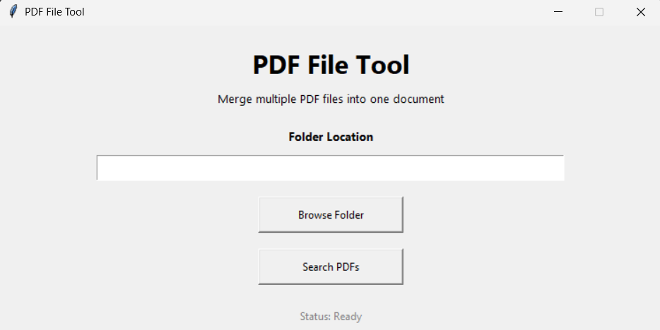
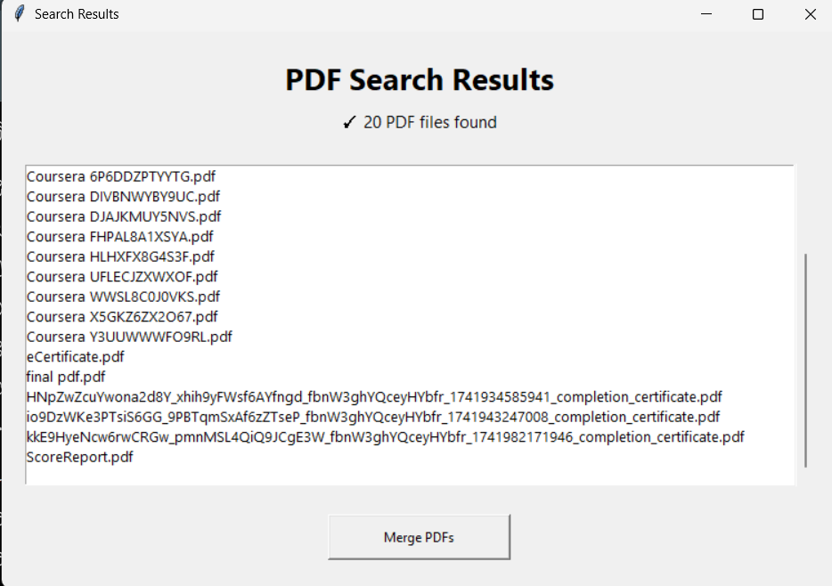

# 📄 PDF File Tool

A desktop application built with **Python** and **Tkinter** that allows users to search, validate, and merge multiple PDF files from a selected directory into a single PDF document.

The application provides a simple graphical interface, making PDF merging quick, efficient, and user-friendly.

---

## 📷 Screenshots

### Home Page



### Search Results



---

## ✨ Features

- Browse and select any folder
- Automatically search for PDF files
- Validate selected directory
- Detect when no PDF files are found
- Handle folders containing only one PDF
- Display search results in a graphical interface
- Merge multiple PDF files into one document
- Save the merged PDF using a custom file name and location
- User-friendly error and success messages
- Modern desktop interface with an intuitive workflow

---

## 🛠 Technologies Used

- Python 3.12
- Tkinter
- PyPDF2
- Object-Oriented Programming (OOP)

---

## 📁 Project Structure

```text
pdf_file_tool/
│
├── assets/
│   ├── home_page.png
│   └── result_page.png
│
├── gui/
│   ├── home_page.py
│   └── result_page.py
│
├── models/
│   └── pdf_info.py
│
├── services/
│   ├── pdf_finder.py
│   └── pdf_merger.py
│
├── tests/
│
├── utils/
│   ├── messages.py
│   └── validators.py
│
├── .gitignore
├── main.py
├── requirements.txt
└── README.md
```

---

## 🚀 Installation

### Clone the repository

```bash
git clone https://github.com/ishaikhamaan07/pdf_file_tool.git
```

### Navigate to the project folder

```bash
cd pdf_file_tool
```

### Install the required dependencies

```bash
pip install -r requirements.txt
```

### Run the application

```bash
python main.py
```

---

## 📖 Application Workflow

1. Launch the application.
2. Browse and select a folder containing PDF files.
3. Click **Search PDFs**.
4. View all discovered PDF files.
5. Click **Merge PDFs**.
6. Choose the destination and file name.
7. Save the merged PDF.

---

## 📌 Future Improvements

- Drag and drop support
- PDF preview before merging
- Split PDF functionality
- Password-protected PDF support
- Dark mode
- Progress bar during merge operations
- Merge selected PDFs instead of all PDFs
- Remember previously selected folder

---

## 👨‍💻 Author

**Amaan Shaikh**

GitHub: [ishaikhamaan07](https://github.com/ishaikhamaan07)

---

## 📄 License

This project is intended for educational and portfolio purposes.